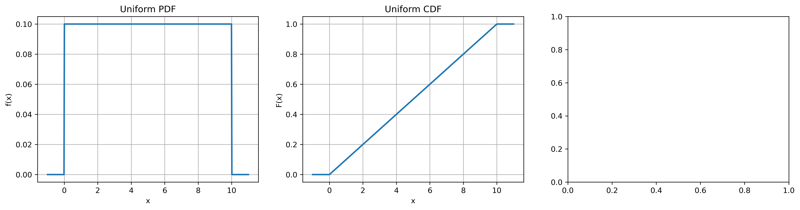
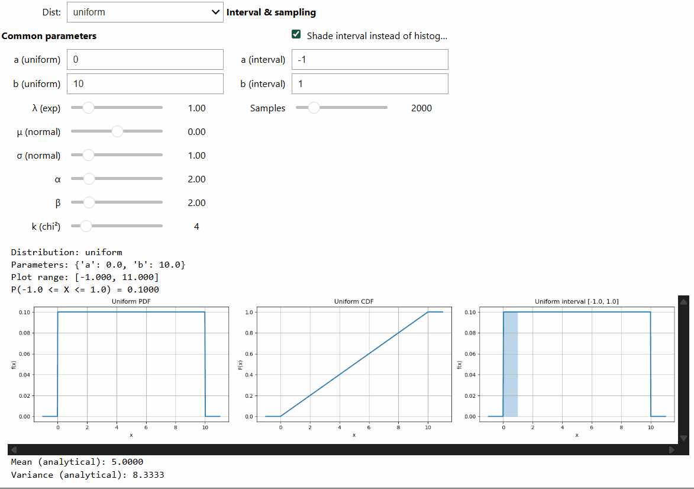

# 📈 Continuous Distributions Visualizer  
*A complete visual laboratory for continuous probability distributions using Python.*

This project helps you **understand and explore continuous random variables** visually.  
It includes:

- Modular distribution classes  
- PDF & CDF visualization  
- Interval shading with computed probabilities  
- Sample histogram vs PDF  
- Automatic image saving  
- An **interactive widget-based visualizer** for experimentation  

This project is part of my “Mastering Statistics” learning series.

---

# 🌟 Features

### ✅ Supports the most important continuous distributions
- **Uniform(a, b)**
- **Exponential(λ)**
- **Normal(μ, σ²)**
- **Gamma(α, β)**
- **Beta(α, β)**
- **Chi-square(k)**

### ✅ Visual tools for deep intuition
- Probability Density Function (PDF)
- Cumulative Distribution Function (CDF)
- Shaded area for interval probability  
  ➤ Computes `P(a ≤ X ≤ b)`  
- Histogram of random samples with PDF overlay  
- Analytical mean & variance printed

### ✅ Automatic image saving
Every time you run `visualize_distribution`, the following images are saved:

images/<distribution>_pdf.png

images/<distribution>_cdf.png

images/<distribution>_hist.png or images/<distribution>_interval.png


Examples:


### ✅ Interactive Exploration (ipywidgets)
A fully interactive control panel lets you adjust parameters live:

- sliders for μ, σ, λ, α, β, k  
- toggle interval shading  
- choose distribution from dropdown  
- instantly see how shape changes  

---

# 🎛 GIF Demo of the Interactive Viewer



---

# 🗂 Folder Structure
```bash
continuous_distributions_visualizer/
│── distributions.py # Distribution classes (pdf, cdf, sample, mean, var)
│── plots.py # PDF/CDF/interval/histogram plotting (with saving)
│── utils.py # Helper logic for probability and plotting ranges
│── main.ipynb # Main analysis notebook + visualize_distribution
│── interactive_viewer.ipynb# Standalone interactive visualizer (ipywidgets)
│── images/
│ ├── normal_pdf.png
│ ├── normal_cdf.png
│ ├── normal_interval.png
│ └── interactive_demo.gif
└── README.md
```

---

# 🔧 Installation

Install required Python packages:

```bash
pip install numpy scipy matplotlib ipywidgets
```
# Usage
 ## 1. Static Visualization (main.ipynb)
Example:
```bash
visualize_distribution(
    "normal",
    a_interval=-1,
    b_interval=1,
    mu=0,
    sigma=1,
    sample_size=3000
)
```
This will:
- Show 3 plots (PDF, CDF, interval/histogram)
- Print mean & variance
- Save images

## 2. Interactive Mode (ipywidgets)
Open:
```bash
interactive_viewer.ipynb
```
Run all cells — then execute:
```bash
interactive_continuous_visualizer()
```
You’ll get:
- Distribution dropdown
- Sliders for parameters
- Interval toggle
- Sample size control
- Three live-updating plots
This is the best way to build intuition for each distribution.

## Why This Project Exists

This project is part of my effort to master statistics, not just theoretically but also practically in Python.
By modularizing each distribution and building reusable visualization tools, the project becomes:
- a personal learning lab
- a teaching tool
- a reusable component for future statistical work

# Contributing
Suggestions / issues / improvements welcome.
This project will grow with more distributions, better UIs, and real-world datasets.

## License
MIT License (modify if needed).


---

## Want me to also generate:
### ✔ a very polished “Project Banner” image?  
### ✔ a second GIF showing histogram smoothing with larger samples?  
### ✔ a version of README with collapsible sections?

Just tell me!

# Author
**Pranav Alok**
~ BS Analytics and Sustainability Studies
~ TISS Mumbai
~ [LinkedIn](https://www.linkedin.com/in/pranav-alok-aa0664338/)


